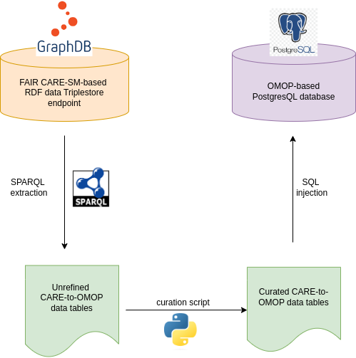

# CARE-SM to OMOP-CDM Mapping Service

## Overview

The CARE-SM to OMOP-CDM Mapping Service is designed to facilitate the integration of clinical and research data from CARE-SM into the OMOP Common Data Model (CDM).


<p align="center"> 
	 
</p>
<p align="center"><b>CARE2OMOP ETL workflow</b></p>


## Table of Contents

- [Usage](#usage)
- [Docker and API](#docker-and-api)
- [License](#license)


## Usage

1. **Configure the service**: Create the configuration file (`config.yaml`) with your Triplestore credentials details.

    ```yaml
    TRIPLESTORE_URL: https://graphdb.triplestore/endpoint
    TRIPLESTORE_USERNAME: username
    TRIPLESTORE_PASSWORD: password
    ```

2. **Execute main.py**:
    ```sh
    python main.py
    ```
    `configuration.yaml` needs to be in the same path as `main.py`:
    ```
    care2omop/
    ├── configuration.yaml
    ├── main.py
    ```


## Docker and API

Docker and API as a web service is under development.


## License

This project is licensed under the MIT License. See the [LICENSE](LICENSE) file for details.

---
